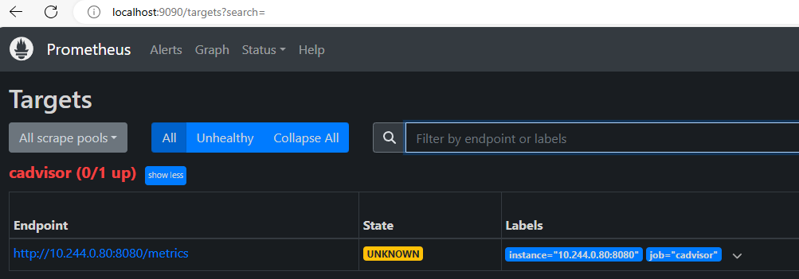
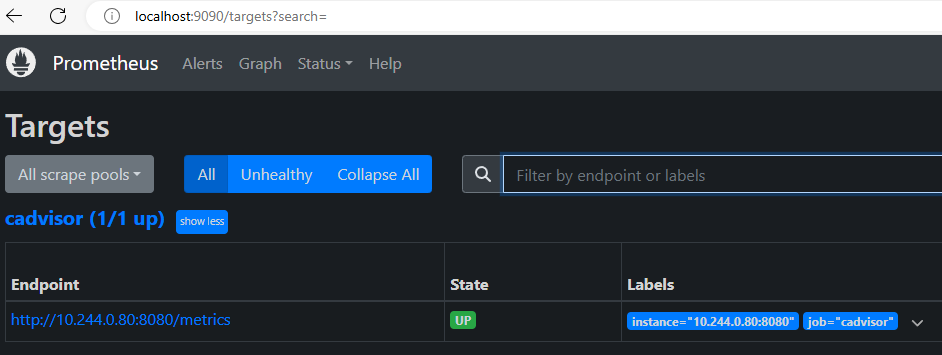

# Infinite loading with local Kubernetes (e.g. Grafana or other Kubernetes related sources)
This can sometimes happen. You can either take a break and see if it still is loading after 15 minutes. Otherwise, you can try another solution:

The solution is to stop the Kubernetes cluster with:
```sh 
minikube stop
```

And then rerun it
```sh
minikube start
```
Possibly also restarting other things, such as forwarding Grafana.

# Using Kubernetes dashboard for trouble shooting
Run
```sh
minikube dashboard
```
To open the dashboard. Here you can see pods running and debug it that way. For example, if you click on the three dots and select "Logs" you can view the logs of the different containers in the pod. For instance, the following error was present in one of my earlier issues:
```
ts=2024-07-01T15:35:06.232Z caller=main.go:537 level=error msg="Error loading config (--config.file=/etc/config/prometheus-config.yaml)" file=/etc/config/prometheus-config.yaml err="parsing YAML file /etc/config/prometheus-config.yaml: yaml: unmarshal errors:\n  line 5: field global already set in type config.plain"
```
Then I viewed the configMaps in the Kubernetes dashboard under Config and Storage section > Config Maps. Here I saw "prometheus-server" config map had two global sections. I then fixed my prometheus-config.yaml file and updated it:
```sh
# Run the script to apply the configmap and delete the pod (recreates it automatically == restart pod)
# Replace with real string-id of the pod name (e.g. prometheus-server-5787759b8c-46gwn)
./reconfigurePrometheusServer.sh prometheus-server-string-id

# Kubernetes automatically restarted this pod for me and then it worked!
```

# Prometheus not showing target, while it is displayed in my configmap
This is due to the reason that you may use Kubernetes service discovery to find pods. In this example you can see a prometheus config for the job name that adds the data for cadvisor:
```yaml
global:
  scrape_interval: 15s
  evaluation_interval: 15s

scrape_configs:
  - job_name: 'cadvisor'
    # Configures Kubernetes service discovery to find pods
    kubernetes_sd_configs:
      - role: pod
    # Configures relabeling rules
    relabel_configs:
      # Keep only pods with the label app=cadvisor (otherwise all other metrics will be included, but you only want cadvisor metrics)
      - source_labels: [__meta_kubernetes_pod_label_name]
        action: keep
        regex: cadvisor
      # Replace target with pod IP and port 8080 (where cadvisor runs)
      - source_labels: [__meta_kubernetes_pod_ip]
        action: replace
        target_label: __address__
        regex: (.+)
        replacement: ${1}:8080
```
Here you can see that 'kubernetes_sd_configs' is used. The issue I had was that I first used:
```yaml
- source_labels: [__meta_kubernetes_pod_label_app]
```
Here I used app instead of name for the labels to discover pods. However, that label did not exist. You can list labels of the pods using this command:
```sh
# Replace the part after -n with the namespace the pod is in
kubectl get pods -n kube-system --show-labels

# Or to show all namespaces labels:
kubectl get pods --all-namespaces --show-labels

# Example output:
NAME                               READY   STATUS    RESTARTS       AGE    LABELS
cadvisor-p7bbr                     1/1     Running   1 (98m ago)    100m   controller-revision-hash=7d9b7fb895,name=cadvisor,pod-template-generation=1
coredns-7db6d8ff4d-d86gf           1/1     Running   2 (125m ago)   16h    k8s-app=kube-dns,pod-template-hash=7db6d8ff4d
etcd-minikube                      1/1     Running   2 (125m ago)   16h    component=etcd,tier=control-plane
kube-apiserver-minikube            1/1     Running   2 (125m ago)   16h    component=kube-apiserver,tier=control-plane
kube-controller-manager-minikube   1/1     Running   2 (125m ago)   16h    component=kube-controller-manager,tier=control-plane
kube-proxy-q5v85                   1/1     Running   2 (125m ago)   16h    controller-revision-hash=79cf874c65,k8s-app=kube-proxy,pod-template-generation=1
kube-scheduler-minikube            1/1     Running   2 (125m ago)   16h    component=kube-scheduler,tier=control-plane
storage-provisioner                1/1     Running   3 (125m ago)   16h    addonmanager.kubernetes.io/mode=Reconcile,integration-test=storage-provisioner
```
In the example output you can see that only the name label is present for cadvisor, and not the app label. Therefore, I changed the label to the original yaml code snippet above and restarted Prometheus (see issue below: this restarts Prometheus (1. create/update configmap/2. delete prometheus-server pod to automatically restart it./3. port forward to view changes)).

# cadvisor metrics not including 'name' label
Make sure that you have applied the correct configmap to Prometheus and that cadvisor is running as a separate daemonset.
Firstly, run cadvisor as a separate daemonset:
```sh
# Create the daemonset using the cadvisor daemonset yaml file
kubectl apply -f "/mnt/c/Users/cpoet/IdeaProjects/EnergyEfficiency_DYNAMOS/charts/core/cadvisor-daemonset.yaml"
```

Then prometheus needs to be configured appropriately:
```sh
# Run the script to apply the configmap and delete the pod (recreates it automatically == restart pod)
# Replace with real string-id of the pod name (e.g. prometheus-server-5787759b8c-46gwn)
./reconfigurePrometheusServer.sh prometheus-server-string-id

# Then port forward promtheus and see if it is working
kubectl port-forward svc/prometheus-server 9090:80 -n default
```
Go to the Prometheus UI and navigate to Status > Targets. Here you should see that cadvisor is in the targets:



At first it will say down/unhealthy, because it is still initializing. (Except if there are errors shown). In a minute (you could try refreshing the page to see it faster) it should say up and when it says you can see something like this:



Then you can see that the target is up and new metrics have been collected. Then you can go to /graph in the Prometheus UI to view the changes:

```sh
# There are different metrics available now for this metric example, such as this format:
container_cpu_system_seconds_total{id="/", instance="10.244.0.80:8080", job="cadvisor"}

# Or this format:
container_cpu_system_seconds_total{id="/kubepods.slice/kubepods-besteffort.slice/kubepods-besteffort-pod08645525_d2f6_45db_a76a_ef770b179f8d.slice", instance="10.244.0.80:8080", job="cadvisor"}

# Or this format
container_cpu_system_seconds_total{container_label_annotation_kubernetes_io_config_seen="2024-07-02T05:26:47.297169660Z", container_label_annotation_kubernetes_io_config_source="api", container_label_app="grafana", container_label_io_kubernetes_container_name="POD", container_label_io_kubernetes_docker_type="podsandbox", container_label_io_kubernetes_pod_name="grafana-864bdb476c-qklw6", container_label_io_kubernetes_pod_namespace="core", container_label_io_kubernetes_pod_uid="0b973a09-283f-4fd7-a890-e3cfdef48af4", container_label_pod_template_hash="864bdb476c", id="/kubepods.slice/kubepods-besteffort.slice/kubepods-besteffort-pod0b973a09_283f_4fd7_a890_e3cfdef48af4.slice/docker-f4cbc2b4601ad7f825435098358f5aefa18abdb9332098400da0973893a3b8f2.scope", image="registry.k8s.io/pause:3.9", instance="10.244.0.80:8080", job="cadvisor", name="k8s_POD_grafana-864bdb476c-qklw6_core_0b973a09-283f-4fd7-a890-e3cfdef48af4_2"}

# This is the format you are looking for, as it contains the name of the container (container_label_io_kubernetes_container_name="linkerd-proxy"):
container_cpu_system_seconds_total{container_label_annotation_io_kubernetes_container_hash="3a050d51", container_label_annotation_io_kubernetes_container_ports="[{"name":"linkerd-proxy","containerPort":4143,"protocol":"TCP"},{"name":"linkerd-admin","containerPort":4191,"protocol":"TCP"}]", container_label_annotation_io_kubernetes_container_restartCount="2", container_label_annotation_io_kubernetes_container_terminationMessagePath="/dev/termination-log", container_label_annotation_io_kubernetes_container_terminationMessagePolicy="FallbackToLogsOnError", container_label_annotation_io_kubernetes_pod_terminationGracePeriod="30", container_label_io_kubernetes_container_logpath="/var/log/pods/linkerd_linkerd-proxy-injector-67945967d6-r9vg7_3560a86c-7de3-448d-b452-68d50f15e607/linkerd-proxy/2.log", container_label_io_kubernetes_container_name="linkerd-proxy", container_label_io_kubernetes_docker_type="container", container_label_io_kubernetes_pod_name="linkerd-proxy-injector-67945967d6-r9vg7", container_label_io_kubernetes_pod_namespace="linkerd", container_label_io_kubernetes_pod_uid="3560a86c-7de3-448d-b452-68d50f15e607", container_label_io_kubernetes_sandbox_id="37e308d755f551e5ac00565d3daf4d7fb58c67993d3913b7bbe293e426cccea3", id="/kubepods.slice/kubepods-besteffort.slice/kubepods-besteffort-pod3560a86c_7de3_448d_b452_68d50f15e607.slice/docker-877f95410fc8ff758ceb4525bf4b4d6452804e2539d3b48d77ec5721019a3469.scope", image="sha256:c50fbb2aec4d19e6b5b03e7d13da23145f8c50e1f333199f5a2a446d8e37bcf7", instance="10.244.0.80:8080", job="cadvisor", name="k8s_linkerd-proxy_linkerd-proxy-injector-67945967d6-r9vg7_linkerd_3560a86c-7de3-448d-b452-68d50f15e607_2"}
```
The final example shows the linkerd-proxy name as the name of the container (container_label_io_kubernetes_container_name="linkerd-proxy"). This is the name you want to see, because as you can see in the image below:


The 'linkerd-proxy-injector-67945967d6-r9vg7' pod contains the container with name 'linkerd-proxy'. This can be seen by the following information in the last output:
container_label_io_kubernetes_pod_name="linkerd-proxy-injector-67945967d6-r9vg7"

This is also what it should be for grouping the results by name, then you can filter by containers for example:


# Helm issues
Example:
```sh
poetoec@LAPTOP-IA1OBTR5:/mnt/c/Users/cpoet/IdeaProjects/EnergyEfficiency_DYNAMOS/energy-efficiency/scripts$ helm install prometheus prometheus-community/kube-prometheus-stack --namespace monitoring --create-namespace --wait
Error: INSTALLATION FAILED: cannot re-use a name that is still in use
```
This is related to a release or namespace that may conflict. List the repo or all releases using these commands:
```sh
# List repost
helm repo list
# List releases
helm list
# List namespaces
kubectl get namespaces

# Uninstall release
helm uninstall <releaseName>
# Delete namespaces
kubectl delete namespace <namespaceName>
```
The example error above is because the namespace already existed, after removing it and rerunning the command it worked again.

# Grafana (or other forwarded port taking too long)
```sh
E0626 17:29:45.184192   11096 portforward.go:351] error creating error stream for port 3000 -> 3000: Timeout occurred
```
This is an example of the error that can occur when the loading takes too long. What you can then do is restart the minikube cluster:
```sh
# Stop the cluster
minikube stop
# Restart the cluster
minikube start
```

If something else is taking very long, such as the port forward operation, you could try restarting wsl:
```sh
# exit wsl session (if you have a wsl session (terminal) open)
exit
# Restart wsl
wsl --shutdown

# Restart Docker Desktop to start the Docker engine
# Restart Kubernetes
minikube start

# Then retry the command
```
Something that is also important is that the services must be running. So, verify in your minikube dashboard for example that the pods and all other services are not still in status "ContainerCreating" or "Pending", because that will cause errors like:
```sh
poetoec@LAPTOP-IA1OBTR5:/mnt/c/Users/cpoet/IdeaProjects/EnergyEfficiency_DYNAMOS/energy-efficiency/scripts$ kubectl port-forward svc/prometheus-kube-prometheus-prometheus -n prometheus 9090:9090
error: timed out waiting for the condition

# Or:
poetoec@LAPTOP-IA1OBTR5:/mnt/c/Users/cpoet/IdeaProjects/EnergyEfficiency_DYNAMOS/energy-efficiency/scripts$ kubectl port-forward svc/prometheus-kube-prometheus-prometheus -n prometheus 9090:9090
error: unable to forward port because pod is not running. Current status=Pending
```

If that not works, there is probably something with the resources/services in the namespace. You can try to remove the namespace and change the configuration and recreate it. For example, I had a prometheus-config.yaml file that was not properly configured and therefore prometheus could not be used, while there where no error messages anywhere, it just took too long to access.

# Cluster role exists
```sh
poetoec@LAPTOP-IA1OBTR5:/mnt/c/Users/cpoet/IdeaProjects/EnergyEfficiency_DYNAMOS/energy-efficiency/scripts$ helm install prometheus prometheus-community/kube-prometheus-stack -f "/mnt/c/Users/cpoet/IdeaProjects/EnergyEfficiency_DYNAMOS/charts/core/prometheus-config.yaml"
Error: INSTALLATION FAILED: Unable to continue with install: ClusterRole "prometheus-kube-state-metrics" in namespace "" exists and cannot be imported into the current release: invalid ownership metadata; annotation validation error: key "meta.helm.sh/release-namespace" must equal "default": current value is "monitoring"
```
The easiest is to remove the cluster role with for example:
```sh
kubectl delete clusterrole prometheus-kube-state-metrics
```
This is a solution that can be used for all errors similar to the above example. Alternatively, you could delete the Kubernetes cluster and recreate it if there are too many issues with all the different resources in the Kubernetes cluster:
```sh
# Delete minikube Kubernetes cluster
minikube delete
# Recreate 
minikube start
# Follow all getting started steps again to see if it is working
```

## Script file (.sh) error
Error (or similar):
```sh
./2_prepareRabbitMQ.sh: line 1: $'\r': command not found
./2_prepareRabbitMQ.sh: line 3: $'\r': command not found
./2_prepareRabbitMQ.sh: line 47: syntax error: unexpected end of file
```
This suggests that the file has Windows style line endings (CRLF) instead of Unix/Linux-style line endings (LF).

This can be fixed by using dos2unix package:
```sh
# Install first if necessary
sudo apt-get update
sudo apt-get install dos2unix

# Convert script file to LF
# e.g.: dos2unix /mnt/c/Users/cpoet/IdeaProjects/EnergyEfficiency_DYNAMOS/energy-efficiency/scripts/2_prepareRabbitMQ.sh
dos2unix <pathToFile>
```